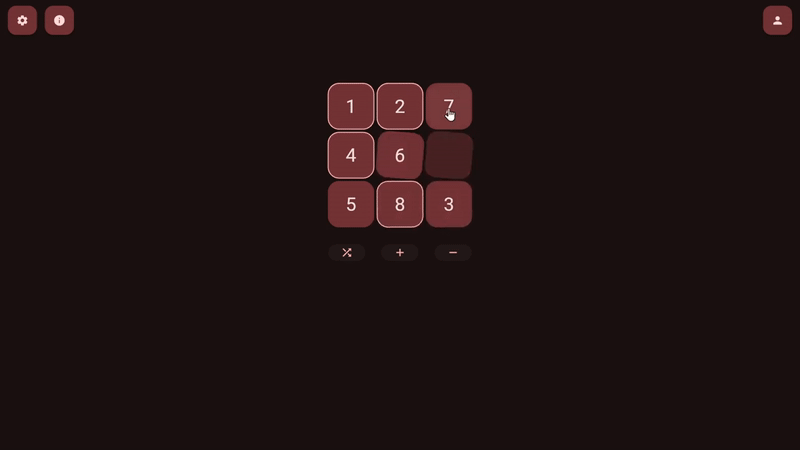

# It's harder than it looks! 👀⚔️

Cubik is a simple game based on the 8-puzzle dilemma. The goal is to arrange the numbers in ascending order by moving the pieces through the empty space. It seeks to expand on the original concept by using varying board sizes and statistics tracking.



## Development 🛠️

- Clone the repository:

  ```shell
  git clone https://github.com/Dy0gu/Cubik.git
  ```

- Install the dependencies:

  ```shell
  flutter pub get
  ```

- Run the app on your platform of choice:

  ```shell
  flutter run
  ```

## Tooling 🧰

- Husky is used for pre-commit hooks to run the linter, install them using this command:

  ```shell
  dart run husky install
  ```

  When using husky, commits may take a bit longer and fail if the linter finds issues. Simply fix, stage and commit these files again to proceed.

## Build & Deployment 🚀

- For setting the final icon and splash screen on all platforms see
  [flutter_launcher_icons](./flutter_launcher_icons.yaml) and [flutter_native_splash](./flutter_native_splash.yaml), respectively.

### Web

- Create the static files for deployment:

    ```shell
    flutter clean
    flutter pub get
    flutter build web --release --wasm --no-tree-shake-icons
    ```

- Serve the files using a web server.

### Android

- Create the `appbundle` for play store publishing (use `apk` instead for local install/testing):

    ```shell
    flutter clean
    flutter pub get
    flutter build appbundle --release --no-tree-shake-icons
    ```

    If you get this error:

    ```shell
    Execution failed for task ':app:signReleaseBundle'.
    > A failure occurred while executing com.android.build.gradle.internal.tasks.FinalizeBundleTask$BundleToolRunnable
      > java.lang.NullPointerException (no error message)
    ```

    It probably means you did not create the `android\key.properties` file correctly. This file is needed for signing the bundle and should be based on the `android\key.properties.example` file.

- Upload the built app bundle to the [Google Play Console](https://play.google.com/console).

    If Google Play says your release should target the latest Android version, simply update flutter (or manually edit the [targetSdkVersion](./android/app/build.gradle) file to a string literal) and compile the app again.

### TODO: iOS, MacOS, Windows, Linux
